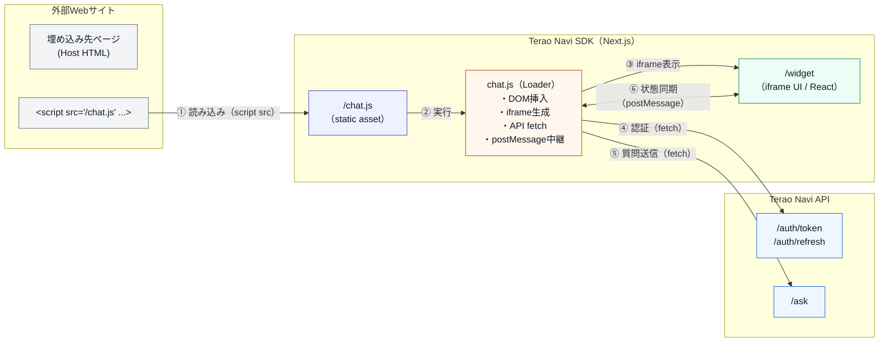

# Terao Navi SDK

**AIチャットウィジェットSDK** - 外部Webサイトに埋め込み可能なチャットUI（Next.js + React）

`chat.js` を1行読み込むだけで、右下にチャットウィジェットを表示できます。
ウィジェットは `iframe`（`/widget`）で描画し、API呼び出し（認証/質問送信）は軽量ローダーの `chat.js` が担当します。

## 目次

- [特徴](#特徴)
- [アーキテクチャ](#アーキテクチャ)
- [クイックスタート](#クイックスタート)
- [組み込み方法](#組み込み方法)
- [設定（data属性）](#設定data属性)
- [開発](#開発)
- [デプロイ](#デプロイ)
- [ライセンス](#ライセンス)

## 特徴

- **簡単導入** - HTMLに `script` タグを追加するだけ
- **UIはiframe分離** - 既存サイトのCSS/JSと干渉しにくい
- **軽量ローダー** - `public/chat.js` が埋め込みとAPI通信を担当
- **postMessage連携** - 親（埋め込み側）↔ 子（iframe）で状態同期
- **カスタマイズ** - タイトル/テーマ色/表示モード（プレビュー）をdata属性で指定
- **Next.js** - `next dev` / `next build` / `next start` に対応

## アーキテクチャ

### システム全体構成



### 役割分担

- `public/chat.js`
  - DOMにウィジェットを挿入（`#terao-navi-chat` を作成/再利用）
  - `iframe` で `/widget` を表示
  - APIへの `fetch`（認証・質問送信）
  - `postMessage` でUI（iframe）とメッセージ/typing/最小化を同期
- `app/widget/page.tsx`
  - `title` / `color` をクエリから受け取りウィジェットUIへ反映
- `components/*`
  - Reactコンポーネント群（ヘッダー、メッセージ、入力欄など）

## クイックスタート

### 前提条件

- Node.js（推奨: LTS）
- npm
- 連携先の **Terao Navi API**（別リポジトリ）

### ローカル起動

```powershell
# 依存関係インストール
npm install

# 開発サーバー起動
npm run dev
```

既定では `http://localhost:3000` で起動します。

### デモページ

開発サーバー起動後、次を開くと埋め込み動作を確認できます。

- `http://localhost:3000/demo.html`

## 組み込み方法

埋め込み先のHTMLに以下を追加します。

```html
<div id="terao-navi-chat"></div>
<script
  src="https://YOUR_SDK_DOMAIN/chat.js"
  data-company-id="1"
></script>
```

- `div#terao-navi-chat` は省略可能です（存在しない場合は `chat.js` が自動生成します）
- 本番では `YOUR_SDK_DOMAIN` を実際の配信先に置き換えてください

## 設定（data属性）

`<script src=".../chat.js" ...>` に以下の属性を設定できます。

| 属性 | 必須 | 説明 | 例 |
|---|---:|---|---|
| `data-company-id` | ✅ | 企業ID（認証に使用） | `"1"` |
| `data-application-id` |  | アプリケーションID（質問送信に付与） | `"2"` |
| `data-chat-title` |  | ランチャー/ヘッダー表示名 | `"AIに質問"` |
| `data-chat-color` |  | テーマ色（UIのアクセント） | `"#ea6666"` |
| `data-preview` |  | `true` の場合は固定表示（プレビュー用途） | `"true"` |

### API Base URLについて

`public/chat.js` 内の `apiBaseUrl` が現在 **`http://localhost:8005` に固定**されています。

## 開発

### 主なコマンド

```powershell
npm run dev      # 開発サーバー
npm run build    # ビルド
npm run start    # 本番起動
npm run lint     # ESLint
```

### CORSについて

`next.config.ts` で `/chat.js` と `/api/*` に対してCORSヘッダーを付与しています。
外部サイトから `chat.js` を読み込む用途を想定しています。

## デプロイ

一般的なNext.jsアプリと同様にデプロイできます。

- Vercel / Cloud Run / ECS などにデプロイ
- `next build` → `next start`
- `public/chat.js` を外部サイトが参照できるように配信

> 注意: 連携先のTerao Navi API側でも、Originチェックなどのセキュリティ要件を満たす必要があります。

## ライセンス

MIT License. 詳細は `LICENSE` を参照してください。
