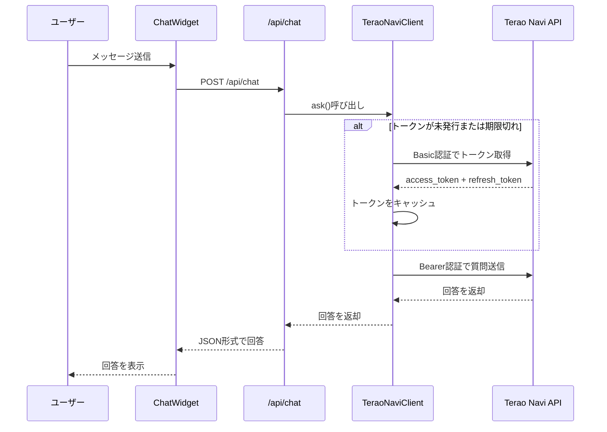
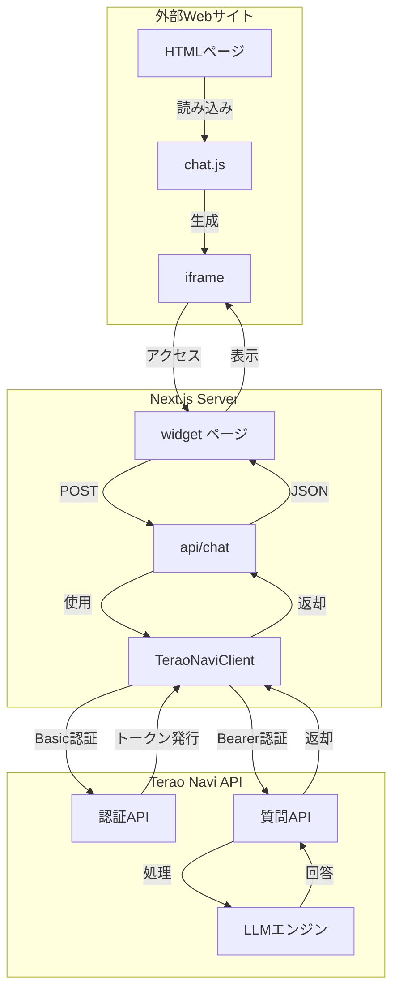

# Terao Navi SDK

**AIチャットウィジェット** - 外部HTMLに簡単に組み込めるチャットウィジェットSDK

Terao Navi APIを活用したLLMベースの質問応答システムを、あなたのWebサイトに簡単に統合できます。

## 目次

- [特徴](#特徴)
- [デモ](#デモ)
- [クイックスタート](#クイックスタート)
- [インストール](#インストール)
- [使い方](#使い方)
- [認証情報の設定](#認証情報の設定)
- [カスタマイズ](#カスタマイズ)
- [アーキテクチャ](#アーキテクチャ)
- [API仕様](#api仕様)
- [開発](#開発)
- [ライセンス](#ライセンス)

## 特徴

- **簡単な組み込み** - わずか2行のコードで導入可能
- **モダンな技術スタック** - Next.js 16 + React 19 + TypeScript
- **レスポンシブデザイン** - デスクトップ・モバイル対応
- **リアルタイムチャット** - スムーズな会話体験
- **セキュア** - iframe分離 + Basic認証 + Bearer Token
- **UXの配慮** - タイピングインジケーター、最小化/最大化機能
- **高パフォーマンス** - 軽量ローダー（chat.js）
- **コンポーネント設計** - 保守性の高いReactコンポーネント

## デモ

デモページで実際の動作を確認できます：

```bash
npm run dev
```

開発サーバー起動後、ブラウザで以下のURLを開いてください：
- デモページ: `http://localhost:3000/demo.html`
- ウィジェットページ: `http://localhost:3000/widget`

## クイックスタート

### 1. プロジェクトのセットアップ

```bash
# リポジトリをクローン
git clone <repository-url>
cd terao_navi_sdk

# 依存関係をインストール
npm install

# 開発サーバーを起動
npm run dev
```

### 2. あなたのHTMLに組み込む

あなたのHTMLファイルに以下のコードを追加するだけで、チャットウィジェットが利用できます：

```html
<!-- チャットウィジェットを表示する場所 -->
<div id="terao-navi-chat"></div>

<!-- ウィジェットを読み込むスクリプト -->
<script
  src="http://localhost:3000/chat.js"
  data-company-id="1"
  data-chat-title="teraid chatへ質問する"
  data-chat-color="#ea6666ff"
  data-preview="false"
></script>
```

## インストール

### 必要な環境

- Node.js 20.x 以上
- npm または yarn

### 依存関係

```json
{
  "dependencies": {
    "next": "16.1.3",
    "react": "19.2.3",
    "react-dom": "19.2.3"
  }
}
```

## 使い方

### 基本的な使い方

```html
<!DOCTYPE html>
<html lang="ja">
<head>
  <meta charset="UTF-8">
  <meta name="viewport" content="width=device-width, initial-scale=1.0">
  <title>My Website</title>
</head>
<body>
  <h1>Welcome to my website!</h1>
  
  <!-- チャットウィジェット -->
  <div id="terao-navi-chat"></div>
  <script
    src="http://localhost:3000/chat.js"
    data-company-id="1"
    data-chat-title="teraid chatへ質問する"
    data-chat-color="#ea6666ff"
  ></script>
</body>
</html>
```

**本番環境での使用:**

```html
<script
  src="https://your-domain.com/chat.js"
  data-company-id="1"
  data-chat-title="teraid chatへ質問する"
  data-chat-color="#ea6666ff"
  data-preview="false"
></script>
```

**プレビューモードでの使用（親要素内に表示）:**

```html
<!-- チャットウィジェットを表示するコンテナ -->
<div id="terao-navi-chat" style="width: 100%; max-width: 800px; margin: 0 auto;"></div>

<script
  src="http://localhost:3000/chat.js"
  data-company-id="1"
  data-chat-title="teraid chatへ質問する"
  data-chat-color="#ea6666ff"
  data-preview="true"
></script>
```

### スクリプトタグの属性

| 属性 | 必須 | 説明 | デフォルト値 |
|------|------|------|-------------|
| `src` | ✓ | ウィジェットのJSファイルのURL | - |
| `data-company-id` | ✓ | 会社ID（数値） | - |
| `data-chat-title` | - | チャットウィンドウのヘッダータイトル | `'teraid chatへ質問する'` |
| `data-chat-color` | - | チャットウィンドウのテーマカラー（16進数カラーコード） | `'#ea6666ff'` |
| `data-preview` | - | プレビューモード。`true`の場合、親要素内に相対配置、`false`の場合は画面右下に固定配置 | `'false'` |

## 設定

### `data-company-id` について

`data-company-id` 属性には、Terao Navi APIで登録された会社IDを数値で設定します。

会社IDは以下のGitHub画面から発行できます（詳しくはリポジトリを確認してください）：

**https://github.com/terao06/terao_navi_web**

この値はHTML上に公開されますが、サーバー側でドメイン制限やその他のセキュリティ対策が実施されています。

#### セキュリティ上の注意

**⚠️ 重要:** 
- 会社IDはHTMLソースコードに埋め込まれるため、**クライアント側で確認可能**です
- Terao Navi APIのサーバー側で、**origin/refererによるドメイン制限**が設定されています
- 本番環境では、**サーバーサイドでの追加のセキュリティ対策**も実施されます

### 認証フロー



すべての認証処理はSDK内部で自動的に行われます。

## カスタマイズ

### チャットウィンドウの外観

`data-chat-color` でテーマカラーを変更できます：

```html
<script
  src="http://localhost:3000/chat.js"
  data-company-id="1"
  data-chat-title="teraid chatへ質問する"
  data-chat-color="#ea6666ff"
></script>
```

### 高度なカスタマイズ

`public/chat.js` および `components/` ディレクトリのReactコンポーネントを編集することで、より詳細なカスタマイズが可能です。

#### コンポーネント構成

```
components/
├── ChatWidget.jsx          # メインコンテナ（状態管理、メッセージ送受信）
├── ChatHeader.jsx          # ヘッダー（タイトル、最小化/最大化ボタン）
├── ChatMessages.jsx        # メッセージリスト（スクロール管理、自動スクロール）
├── ChatMessage.jsx         # 個別メッセージ表示（ユーザー/AI）
├── ChatInput.jsx           # メッセージ入力フィールド（送信ボタン、Enter送信）
└── TypingIndicator.jsx     # タイピングアニメーション（3点リーダー）
```

#### カスタマイズ例

**1. ウィジェットの初期サイズを変更:**

`public/chat.js` の `iframe` スタイルを編集：

```javascript
iframe.style.width = '400px';  // 幅を変更
iframe.style.height = '600px'; // 高さを変更
```

**2. メッセージの表示スタイルを変更:**

`components/ChatMessage.jsx` のスタイルを編集：

```jsx
// ユーザーメッセージの背景色を変更
<div style={{ 
  backgroundColor: isUser ? '#your-color' : '#f3f4f6',
  // ...
}}>
```

**3. プレースホルダーテキストを変更:**

`components/ChatInput.jsx` を編集：

```jsx
<input
  placeholder="ここにカスタムメッセージ..."
  // ...
/>
```

## アーキテクチャ

### 全体構成



システムは3つの主要なレイヤーで構成されています：

1. **外部Webサイト層**: クライアントのHTMLにウィジェットを埋め込み
2. **Next.jsサーバー層**: ウィジェットのレンダリングとAPI処理
3. **Terao Navi API層**: LLMベースの質問応答処理

### データフロー

1. **ユーザー** が外部サイトのチャットウィジェットにメッセージを入力
2. **chat.js** がiframeを生成し、`/widget`ページを読み込み
3. **ChatWidget** コンポーネントがメッセージを `/api/chat` に送信
4. **API Route** が `TeraoNaviClient` を使ってTerao Navi APIを呼び出し
5. **Terao Navi API** がLLMで回答を生成して返却
6. **ChatWidget** が回答をユーザーに表示

### セキュリティ設計

- **iframe分離:** ウィジェットは独立したiframe内で動作し、親ページとのスコープを分離
- **Basic認証:** clientIdとclientSecretによる初回認証
- **Bearer Token:** セッション中はトークンベースの認証を使用
- **Origin/Referer自動送信:** APIサーバー側でドメイン検証可能
- **トークンキャッシュ:** サーバーサイドでトークンを管理（クライアント側に露出しない）

## API仕様

### Terao Navi API

このSDKは、**Terao Navi API** を利用して質問応答機能を提供しています。

API側の詳細な仕様については、以下のリポジトリで確認できます：

**https://github.com/terao06/terao_navi_api**

### SDK内部API

#### POST `/api/chat`

チャット用の内部APIエンドポイント。

**リクエスト:**
```json
{
  "message": "質問内容",
  "company_id": 1,
  "origin": "埋め込み元のorigin",
  "referer": "埋め込み元のフルURL",
  "application_id": 1
}
```

**レスポンス（成功）:**
```json
{
  "success": true,
  "response": "AIからの回答",
  "timestamp": "2026-01-18T12:34:56.789Z"
}
```

**レスポンス（エラー）:**
```json
{
  "error": "エラーメッセージ"
}
```

## 開発

### 開発サーバーの起動

```bash
# 開発モードで起動
npm run dev

# または
npm run dev -- -p 3001  # ポート番号を指定
```

`http://localhost:3000` でアプリケーションが起動します。

### ビルド

```bash
# プロダクションビルド
npm run build

# ビルド後のアプリケーションを起動
npm run start
```

### その他のコマンド

```bash
# リンターチェック
npm run lint

# 型チェック
npx tsc --noEmit
```

### プロジェクト構造

```
terao_navi_sdk/
├── app/
│   ├── api/
│   │   └── chat/
│   │       └── route.ts          # チャットAPI
│   ├── widget/
│   │   ├── layout.jsx            # ウィジェットレイアウト
│   │   └── page.jsx              # ウィジェットページ
│   ├── globals.css
│   ├── layout.tsx
│   └── page.tsx
├── components/
│   ├── ChatWidget.jsx            # メインウィジェット
│   ├── ChatHeader.jsx            # ヘッダー
│   ├── ChatMessages.jsx          # メッセージリスト
│   ├── ChatMessage.jsx           # 個別メッセージ
│   ├── ChatInput.jsx             # 入力フィールド
│   └── TypingIndicator.jsx       # タイピング表示
├── lib/
│   ├── api/
│   │   └── teraoNaviClient.ts    # Terao Navi APIクライアント
│   └── hooks/
│       └── useTeraoNavi.ts       # カスタムフック
├── public/
│   ├── chat.js                   # 外部サイト用ローダー
│   ├── demo.html                 # デモページ
│   └── icons/
├── package.json
├── next.config.ts
├── tsconfig.json
└── README.md
```

### TeraoNaviClient

`lib/api/teraoNaviClient.ts` は、Terao Navi APIとの通信を抽象化したクライアントクラスです。

**主な機能:**
- 2段階認証（Basic → Bearer Token）
- トークン自動管理（発行・更新・キャッシュ）
- リフレッシュトークンによる自動更新
- エラーハンドリング
- TypeScriptサポート

**使用例:**
```typescript
import { TeraoNaviClient } from '@/lib/api/teraoNaviClient';

// クライアントインスタンスを作成
const client = new TeraoNaviClient({
  company_id: 1,                            // 会社ID
  origin: 'https://example.com',            // 埋め込み元のorigin
  referer: 'https://example.com/page',      // 埋め込み元のフルURL
  autoRefresh: true,                        // トークン自動更新を有効化
});

// 質問を送信
const response = await client.ask({
  question: 'こんにちは',
  application_id: 1,
});

console.log(response.data.answer);  // AIの回答を取得
```

**エラーハンドリング:**
```typescript
try {
  const response = await client.ask({
    question: 'こんにちは',
    application_id: 1,
  });
  console.log(response.data.answer);
} catch (error) {
  if (error.response?.status === 401) {
    console.error('認証エラー: company_idを確認してください');
  } else if (error.response?.status === 429) {
    console.error('レート制限: しばらく待ってから再試行してください');
  } else {
    console.error('エラーが発生しました:', error.message);
  }
}
```

## 環境変数

必要に応じて `.env.local` ファイルで設定可能：

```env
# Terao Navi APIのベースURL
NEXT_PUBLIC_API_BASE_URL=https://your-api-domain.com
```

## パフォーマンス最適化

- **chat.js の軽量化**: 必要最小限のコードのみを含めています（約2KB）
- **iframe の遅延読み込み**: ユーザーがウィジェットを開くまで読み込みを遅延
- **トークンキャッシュ**: 認証トークンをメモリにキャッシュしてAPIコール削減
- **React 19**: 最新のReact Server Componentsとパフォーマンス最適化

## ブラウザサポート

- Chrome 90+
- Firefox 88+
- Safari 14+
- Edge 90+

**注意:** IE11はサポートしていません。

## ライセンス

このプロジェクトはMITライセンスの下でライセンスされています。詳細は [LICENSE](LICENSE) ファイルをご覧ください。

## 貢献

プルリクエストを歓迎します！大きな変更の場合は、まずissueを開いて変更内容を議論してください。

### 貢献の流れ

1. このリポジトリをフォーク
2. フィーチャーブランチを作成 (`git checkout -b feature/amazing-feature`)
3. 変更をコミット (`git commit -m 'Add some amazing feature'`)
4. ブランチにプッシュ (`git push origin feature/amazing-feature`)
5. プルリクエストを作成
